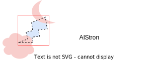
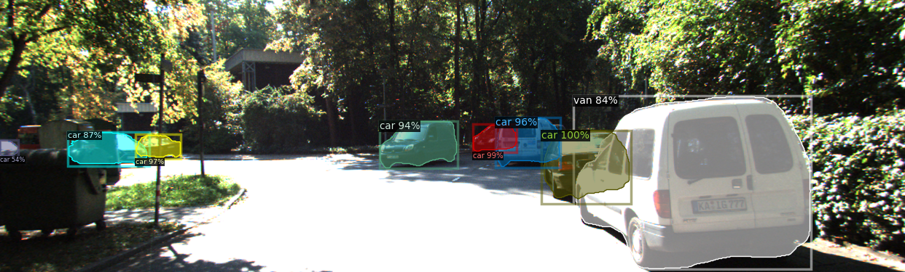

## Introduction

AIStron is an open-source toolbox that provides current Amodal Instance Segmentation (AIS) methods. It is built as a project using detectron2 (version 0.6) and requires PyTorch 1.8+ or higher. The goal of AIStron is to combine the features of various AIS repositories and align them to facilitate easy maintenance and development of new methods.



## News
- v0.1.0 was released on Jun 19, 2023
- BCNet and AISFormer are available (pretrained models coming soon)

## Features
- Data pipeline: We aim to standardize the annotations of existing AIS datasets 
so that the methods can be easily implemented and generalized. This [diagram](assets/doc_imgs/aistron_figures-data_pipeline.png) 
illustrates the data pipeline of aistron

- Amodal Instance Segmentation Evaluator: AIStron helps compute the performance of both visible and amodal masks. 
If a method provides both `pred_visible_masks` and `pred_amodal_masks` in its predictions,
both performances will be computed. If only the conventional `pred_masks` are provided, 
only the amodal performance is computed.

- Utilities: We offer an amodal visualizer utility that allows you to visualize the ground truth or predictions with
option to choose between visible masks, occluder masks and amodal masks. 

- Builtin-Methods:
    - [x] [MaskRCNN](./aistron/modeling/meta_arch/amodal_rcnn.py)

- Methods using aistron as library:
    - [x] [BCNet](./projects/BCNet/)
    - [x] [AISFormer](./projects/AISFormer/)
    - [ ] [ORCNN](./projects/ORCNN/)
    - [ ] [VRSP-Net](./projects/VRSP-Net/)


## Installation
See [installation instructions](docs/INSTALL.md).

## Getting Started
- See [Getting Started with aistron](docs/GETTING_STARTED.md).
- See [Preparing Datasets for aistron](datasets/README.md).

## License
This project is released under the [Apache 2.0 license](./LICENSE).

## Acknowledgements
- We refer to [BCNet](https://github.com/lkeab/BCNet) for dataset mapping with occluder,
[VRSP-Net](https://github.com/YutingXiao/Amodal-Segmentation-Based-on-Visible-Region-Segmentation-and-Shape-Prior) for amodal evaluation.
- We base on and detectron2, Mask2Former, and detrex on designing this project.
## Citing aistron
If you use aistron in your research, please consider citing this repository using the following BibTeX entry.
```BibTeX
@misc{tran2023aistron,
  author =       {Minh Tran, Ngan Le},
  title =        {Amodal Instance Segmentation Toolbox and Benchmark},
  howpublished = {\url{https://github.com/trqminh/aistron}},
  year =         {2023}
}
```
